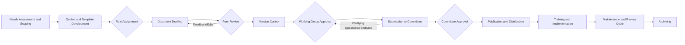

# Document Approval Workflow

This implementation demonstrates a comprehensive document approval workflow using PocketFlow, showcasing the framework's ability to handle complex, multi-stage processes with human-in-the-loop interactions.

## Overview

The workflow implements the following process:



## Key Features

### 1. Context-Driven Document Creation
- Reads comprehensive context from `context.yml`
- Ensures document aligns with defined scope, audience, and constraints
- Validates deliverables match requirements

### 2. Hierarchical Flow Composition
- **WorkingGroupFlow**: Encapsulates drafting, peer review, and internal approval
- **CommitteeFlow**: Handles formal submission and committee approval process
- **Main Flow**: Orchestrates all phases from context loading to archiving

### 3. Review and Approval Cycles
- Supports iterative review with feedback incorporation
- Conditional transitions based on review outcomes
- Tracks all decisions in audit trail

### 4. Human-in-the-Loop Integration
- Interactive CLI prompts for reviews and approvals
- Collects detailed feedback for revisions
- Allows clarification requests and responses

## Usage

### 1. Create a Context File

First, ensure you have a `context.yml` file that defines your document requirements. An example is provided in the repository.

### 2. Run the Workflow

```bash
python3 document_workflow.py
```

### 3. Follow the Interactive Prompts

The workflow will guide you through each stage:
- Review auto-generated content
- Provide feedback and approval decisions
- Handle clarification requests
- Track progress through all stages

## Example Interaction

```
Document Approval Workflow Demo
==============================

============================================================
Context Loaded Successfully
============================================================
Topic: API Security Guidelines
Document Type: Technical Standard
Purpose: Establish security standards and best practices for REST API development across the organization
============================================================

============================================================
Needs Assessment
============================================================
Analyzing requirements for: API Security Guidelines

Audience:
  Primary:
    - Backend Developers (Mid to Senior)
    - Security Engineers (All levels)
  Secondary:
    - DevOps Engineers (Senior)
    - Technical Leads (Senior)
    - QA Engineers (Mid to Senior)

Are there additional needs to address?
1. Yes
2. No

Enter your choice: 2
```

## Architecture Highlights

### Node Hierarchy
```
BaseNode (from PocketFlow)
  └── DocumentNode (base for all document nodes)
       ├── ReviewNode (handles feedback collection)
       │    └── ApprovalNode (records formal approvals)
       ├── ContextLoaderNode
       ├── NeedsAssessmentNode
       ├── DocumentDraftingNode
       └── ... (other workflow nodes)
```

### Flow Composition
```python
# Flows are Nodes, allowing hierarchical composition
working_group = WorkingGroupFlow()  # A Flow containing multiple nodes
committee = CommitteeFlow()         # Another Flow

# Main workflow treats sub-flows as nodes
main_flow = Flow(start=context_loader)
role_assignment >> working_group >> committee >> publication
```

### State Management
All nodes share a dictionary that tracks:
- Document context and content
- Review feedback and approvals
- Audit trail of all actions
- Version history

## Customization

### Adding New Document Types
1. Create a new context YAML with appropriate fields
2. Extend nodes to handle type-specific requirements
3. Adjust validation rules as needed

### Modifying Approval Logic
1. Override `check_approval_criteria()` in ApprovalNode subclasses
2. Implement custom approval rules based on context
3. Add new approval types (unanimous, majority, single approver)

### Extending Review Process
1. Create new ReviewNode subclasses
2. Implement specialized feedback collection
3. Add domain-specific validation

## Benefits Demonstrated

1. **Composability**: Complex workflows built from simple, reusable components
2. **Flexibility**: Easy to modify flow based on document type or organization needs
3. **Traceability**: Complete audit trail of all decisions and changes
4. **Scalability**: Can handle simple memos to complex policy documents
5. **Integration**: Ready for extension with LLMs, databases, or external systems

## Files

- `context.yml`: Example context definition for API Security Guidelines
- `document_workflow.py`: Complete workflow implementation
- `test_document_workflow.py`: Basic component tests

## Next Steps

1. **LLM Integration**: Add AI-powered content generation for document sections
2. **Database Backend**: Store documents and audit trails persistently
3. **Web Interface**: Replace CLI with web-based review interface
4. **Notification System**: Add email/Slack notifications for reviewers
5. **Template Library**: Build reusable templates for common document types